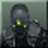

#  Enhanced SCPT Versus
A major patch for Splinter Cell: Pandora Tomorrow's Versus mode, fixing bugs and exploits while improving gameplay.

For a full list of patch notes, refer to the [Patch Notes](PatchNotes.md) page.

If this is your first time wanting to play the Versus modes for the Splinter Cell games, it is highly recommend checking out [Enhanced SCCT Versus](https://github.com/Joshhhuaaa/EnhancedSCCTVersus) instead. SCPT Versus is often considered obsolete as SCCT Versus nearly improves every aspect of it and includes all SCPT Versus maps.

## Installation

The latest version of Enhanced SCPT Versus can be found in the [Releases](https://github.com/Joshhhuaaa/EnhancedSCPTVersus/releases) page. Please note that versions of Enhanced SCPT Versus are not compatible with the default version of the game or previous Enhanced versions.

### Game Setup

Enhanced SCPT Versus comes included with [dgVoodoo2](https://github.com/dege-diosg/dgVoodoo2), a wrapper that can restore the broken dynamic lights on modern PCs for SCPT Versus.

- After downloading Enhanced SCPT Versus, extract the contents, and you should have a Enhanced SCPT Versus folder. You can place it anywhere you like, it's portable.
- In order to play the game, run the command script, `Play SCPT_Versus.cmd`.

The command script will automatically mount the disc image and launch the game. When the game closes, the command script will also unmount the disc image.

- If you need to mount the disc image manually, you can find it at: `System\_PC_\Enhanced\Mount.iso`.

### Additional Screen Resolution Support
 After creating a profile in the game, a profile configuration file named `<profilename>_prf.ini` is generated in the System folder. Once generated, you can open this configuration file to make adjustments to your screen resolution that may not be accessible through the video settings GUI.

| ScreenRes | Resolution            |
|-----------|-----------------------|
| 0         | 640x480               |
| 1         | 800x600               |
| 2         | 1024x768              |
| 3         | 1280x1024             |
| 4         | 7680x4320 / Native    |
| 5         | 1440x1080             |
| 6         | 1920x1080             |
| 7         | 1920x1440             |
| 8         | 2560x1440             |
| 9         | 2880x2160             |
| 10        | 3840x2160             |

ScreenRes 0-4 can be selected in-game through the Video Settings page, while ScreenRes 5-10 can only be set using the user configuration file.

ScreenRes 4 is referred to as "Native Resolution" in-game. This option will apply 8K resolution then if you are using a lower resolution display, it will automatically adjust by rounding down to your native resolution.

### Mouse Polling Rate
Many mice now offer polling rates of 1000 Hz or higher. However, in SCPT Versus, higher polling rates may cause issues with your mouse aim. If your mouse allows it, try setting the polling rate to 125 Hz through software.

### EAX Resotration (optional)
EAX enhances the game's audio using hardware acceleration to process advanced 3D environments. Since Windows Vista, Microsoft has stripped out the DirectSound3D API, preventing EAX from functioning.

- To restore EAX functionality, run the registry file, `eax_restore.reg` in the System folder and press "Yes" to the dialog to add the registry entries.

 This registry file registers `dsound.dll` in Windows, enabling EAX to function. Please note that this registry applies only to your specific Windows user. If you create a new Windows user, you'll need to run the registry file again to restore EAX.

 ## Playing Online
Ubisoft discontinued Pandora Tomorrow's servers in December 2006. However, the multiplayer is still playable when using virtual LAN applications. The most common method in the community currently is to use [Radmin VPN](https://www.radmin-vpn.com/). It's easy to set up, and there's no need for account creation.

- Once Radmin VPN is installed, select "Network" > "Join Network." A window will appear, click on the "Gaming Network" tab, and join the `Tom Clancy's Splinter Cell: Pandora Tomorrow` or `Splinter Cell Pan. Tom.` network.
- If you would like to change your username on Radmin VPN, select "System" > "Change Name" or simply double-click your username.
